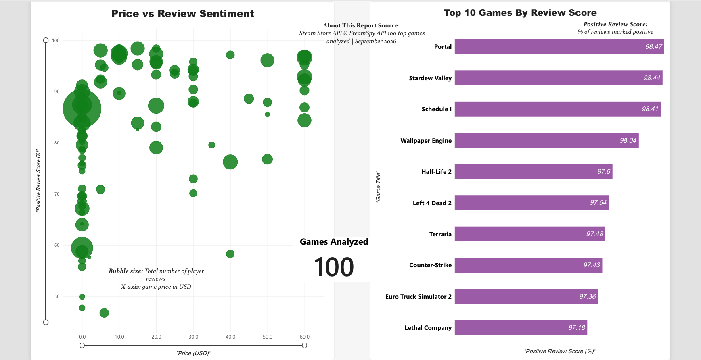
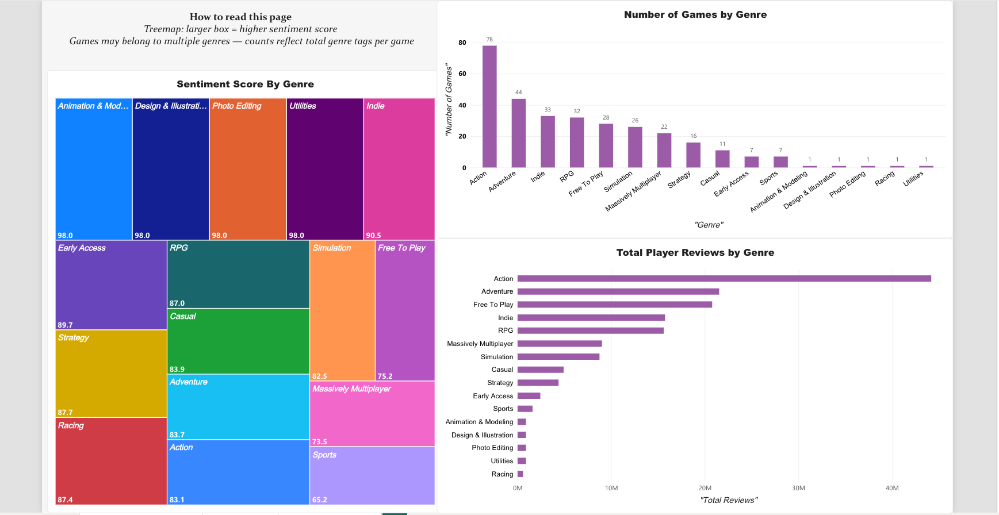
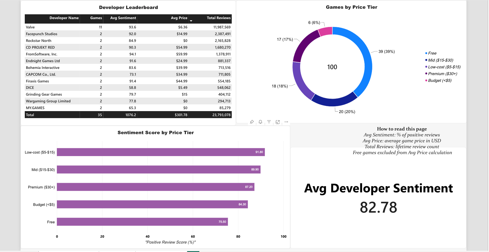

# Steam Market Analytics Dashboard

A business intelligence project analyzing game performance, pricing strategy, 
and review sentiment across the Steam platform using live API data.

## Project Overview

Built an end-to-end analytics pipeline to answer key business questions about 
the Steam gaming market — what drives positive sentiment, how pricing varies 
by genre, and which developers consistently deliver quality titles.

## Business Questions Answered

- What games have the highest positive review scores and why?
- How does price correlate with player sentiment across 100 top titles?
- Which genres command premium pricing vs. budget positioning?
- Which developers consistently deliver high-rated games?
- Do free-to-play games perform better or worse than paid titles?

## Key Findings

- Low-cpst games ($5–$15) have the highest avg sentiment at 91.8% — 
  outperforming both free and premium titles
- Price and sentiment have near-zero correlation (-0.014) — 
  players don't rate expensive games higher
- Action is the most represented genre (78 titles) but Strategy 
  commands the highest avg price at $39
- Valve leads all developers with 11 titles and 11.9M total reviews 
  at 93.6% avg positive sentiment
- Paid games score higher on average (86.5%) vs free-to-play (76.2%)

## Tech Stack

| Tool | Purpose |
|---|---|
| Python (pandas, SQLAlchemy) | Data ingestion and cleaning |
| Steam Store API + SteamSpy API | Live data source |
| PostgreSQL (Neon) | Cloud relational database |
| SQL | Analysis and KPI development |
| Power BI | Dashboard and visualization |

## Database Schema

6 relational tables: `games`, `developers`, `genres`, 
`game_genres`, `prices`, `reviews_summary`

## SQL Highlights

- Multi-table JOINs across 5 tables
- Window functions: RANK(), PARTITION BY, CORR()
- CTEs for tiered analysis
- CASE statements for price bucketing
- HAVING clauses for developer filtering

## Dashboard

[View the live interactive dashboard](https://app.powerbi.com/view?r=eyJrIjoiNDk2NWUwZTAtMDM2OC00NWMzLWEyMjUtNGE4NzhiYmU1YTc5IiwidCI6ImY2YjZkZDViLWYwMmYtNDQxYS05OWEwLTE2MmFjNTA2MGJkMiIsImMiOjZ9)

**Page 1: Game Performance Overview** (top games, price vs. sentiment)



**Page 2: Genre Analysis** (sentiment treemap, game counts, engagement)



**Page 3: Pricing & Developers** (developer leaderboard, price tier breakdown)




## Limitations

- The dataset covers the top 100 Steam titles, so findings describe popular games rather than Steam as a whole.
- Sentiment is based on Steam's positive review ratio, which only reflects players who chose to leave a review.
- Some comparisons (like free vs. paid) rest on small groups within 100 games, so treat them as directional.
- Data is a snapshot from when the pipeline ran; prices and reviews change over time.

## Project Structure

steam-analytics/
├── data/
├── dashboard_data/
├── venv/
├── .env
├── .gitignore
├── .python-version
├── fetch_data.py
├── create_tables.py
├── load_data.py
├── export_for_dashboard.py
├── analysis.sql
├── README.md
└── requirements.txt

## How to Run

```bash
python -m venv venv
source venv/bin/activate
pip install -r requirements.txt

# Add a .env file with your Neon connection string:
# DATABASE_URL=postgresql://...

python fetch_data.py            # pull data from the Steam APIs
python create_tables.py         # build the Postgres schema
python load_data.py             # clean and load data into Neon
python export_for_dashboard.py  # export CSVs for Power BI
```

Run the queries in `analysis.sql` against the database to reproduce the analysis.

## Author

Daniel Muongchanh  
University of Washington Bothell — Data Analytics  
[LinkedIn](https://www.linkedin.com/in/danielmuong/) | [GitHub](https://github.com/dmuong02)# Steam Market Analytics Dashboard

A business intelligence project analyzing game performance, pricing strategy, 
and review sentiment across the Steam platform using live API data.

## Project Overview

Built an end-to-end analytics pipeline to answer key business questions about 
the Steam gaming market — what drives positive sentiment, how pricing varies 
by genre, and which developers consistently deliver quality titles.

## Business Questions Answered

- What games have the highest positive review scores and why?
- How does price correlate with player sentiment across 100 top titles?
- Which genres command premium pricing vs. budget positioning?
- Which developers consistently deliver high-rated games?
- Do free-to-play games perform better or worse than paid titles?

## Key Findings

- Indie games ($5–$15) have the highest avg sentiment at 91.8% — 
  outperforming both free and premium titles
- Price and sentiment have near-zero correlation (-0.014) — 
  players don't rate expensive games higher
- Action is the most represented genre (78 titles) but Strategy 
  commands the highest avg price at $39
- Valve leads all developers with 11 titles and 11.9M total reviews 
  at 93.6% avg positive sentiment
- Paid games score higher on average (86.5%) vs free-to-play (76.2%)

## Tech Stack

| Tool | Purpose |
|---|---|
| Python (pandas, SQLAlchemy) | Data ingestion and cleaning |
| Steam Store API + SteamSpy API | Live data source |
| PostgreSQL (Neon) | Cloud relational database |
| SQL | Analysis and KPI development |
| Power BI | Dashboard and visualization |

## Database Schema

6 relational tables: `games`, `developers`, `genres`, 
`game_genres`, `prices`, `reviews_summary`

## SQL Highlights

- Multi-table JOINs across 5 tables
- Window functions: RANK(), PARTITION BY, CORR()
- CTEs for tiered analysis
- CASE statements for price bucketing
- HAVING clauses for developer filtering

## Dashboard

3-page Power BI dashboard covering:
- **Page 1:** Game Performance Overview — top games, price vs sentiment
- **Page 2:** Genre Analysis — sentiment treemap, game counts, engagement
- **Page 3:** Pricing & Developers — developer leaderboard, price tier breakdown

[View Live Dashboard]([<iframe title="Steam Market Analytics Project" width="600" height="373.5" src="https://app.powerbi.com/view?r=eyJrIjoiNDk2NWUwZTAtMDM2OC00NWMzLWEyMjUtNGE4NzhiYmU1YTc5IiwidCI6ImY2YjZkZDViLWYwMmYtNDQxYS05OWEwLTE2MmFjNTA2MGJkMiIsImMiOjZ9" frameborder="0" allowFullScreen="true"></iframe>](https://app.powerbi.com/view?r=eyJrIjoiNDk2NWUwZTAtMDM2OC00NWMzLWEyMjUtNGE4NzhiYmU1YTc5IiwidCI6ImY2YjZkZDViLWYwMmYtNDQxYS05OWEwLTE2MmFjNTA2MGJkMiIsImMiOjZ9))

## Project Structure

| File | Purpose |
|---|---|
| `fetch_data.py` | Pulls live data from Steam APIs |
| `create_tables.py` | Builds the Postgres schema |
| `load_data.py` | Cleans and loads data into Neon |
| `export_for_dashboard.py` | Exports CSVs for Power BI |
| `analysis.sql` | All 10 SQL analysis queries |
| `dashboard_data/` | Exported CSVs for Power BI |
| `README.md` | Project documentation |
| `requirements.txt` | Python dependencies |

## Author

Daniel Muongchanh  
University of Washington Bothell — Data Analytics  
[LinkedIn](https://www.linkedin.com/in/danielmuong/) | [GitHub](https://github.com/dmuong02)
